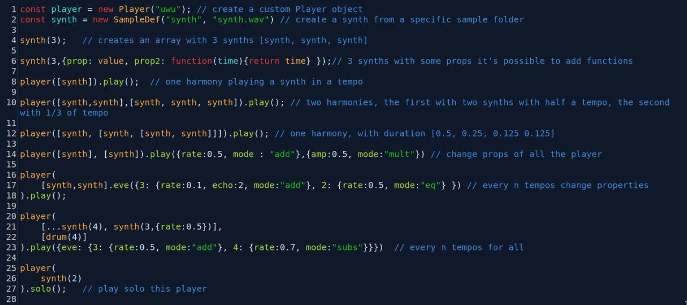
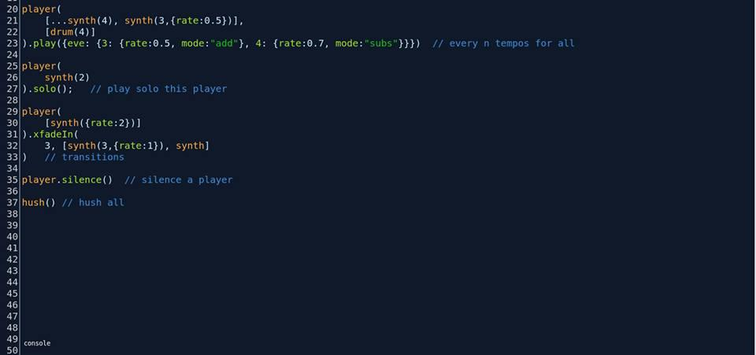
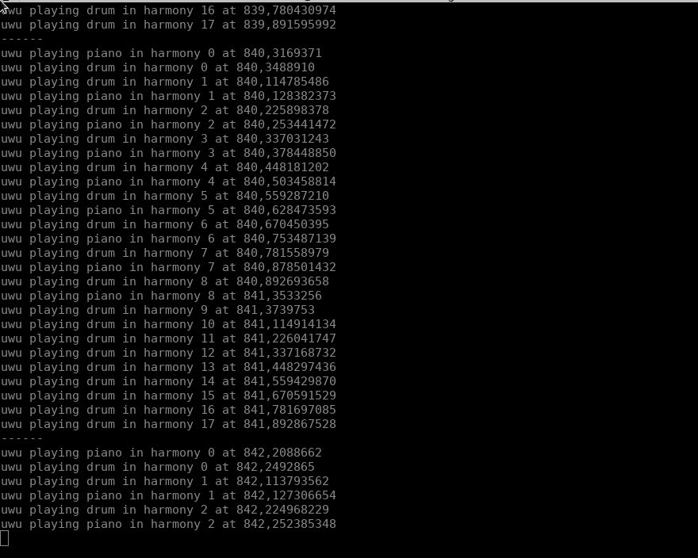

# Cuack 

## Supercollider + NodeJS 

Sequencer web server based, that allows to use native javascript objects for livecoding.

it's still on development, still beta, I'm taking suggestions about musical notations, language and bug fixes.







## Related work

- Flocking 
- Tidalcycles
- FoxDot
- MIDI.js


## requirements

- express
- ws
- osc
- nanotimer
- Supercollider + sc3-plugins.

## Run

Copy the `Cuack` class folder to `Platform.userExtensionDir`


`npm install` for install dependencies


`app.js` runs a web server and a socket server on 127.0.0.1:3000.

Run `Cuack.start` on SuperCollider

## Player object

Calculates timing and sets properties for individuals synths and harmonics.

```
// available default players: p1, p2, p3, p4, p5

let myplayer = new Player("custom");

myplayer().play();

```


## SampleDef object

Holds music properties for sample objects that can change on the fly, available samples are on `samples/` folder, these are loaded when the app runs.

At the moment it's not possible to load samples on the fly.

```
cp({amp:2}).prop

/*

Object {
 type: "SampleDef",
 name: "cp",
 filename: "cp.wav",
 amp: 3,
 pan: 0,
 up: 0,
 atk: 0,
 sus: 1,
 rel: 0,
 dur: 0, 
 echo: 0,
 delay: 0,
 coarse: 0,
 }

 */

```

## SynthDef 

Holds music properties for Synth objects that can change on the fly, available synths are on `synths/` folder, these are loaded when the app runs.

At the moment it's not possible to use Synthdefs.


## Tutorial

This creates a harmony, triggering a "cp" sample with the default bpm (120) on player "p1".

```
p1(
    [cp]
).play();
```

The duration of each synth is automatically stretched to fill 1 tempo evenly, this example returns a harmony with two equal "cp" samples, durations are: `[0.5, 0.5]`.


```
p1(
    [cp, cp]
).play();
```

Arrays are meant to stretch the sound evenly, this example returns a harmony of durations: `[0.5, 0.25, 0.25]`

```
p1(
    [cp, [cp, cp]]
).play();
```

The durations are calculated recursively, flattening to a complex harmony array.

```
p1(
    [cp, [cp,cp,[cp, cp] ]]
).play();
```


```
/*
[ 0.5, [ 0.5 ] ]

[0.5, [ 0.1666, 0.1666 [ 0.1666 ] ] ]

[0.5, [ 0.1666, 0.1666 [ 0.0833 0.0833 ] ] ]

[0.5, [ 0.1666, 0.1666 0.0833 0.0833 ] ]

[ 0.5, 0.1666, 0.1666, 0.0833, 0.0833 ]
*/
```

Harmonies can be made, adding arrays in the player as arguments, this plays two sounds at the same time.

```
p1(
    [cp, cp],
    [sn, sn]
).play();
```
Synths can be repeated with:

```
p1(
    cp.rep(4) // [cp, cp, cp, cp]
).play();
```
To modify properties of a note:

```
cp({amp:2, pan:-1, rate:3}) 

```

or even:

```
cp.rep(3,{rate:3}) // 3 synths with rate = 3
```
we can modify the entire sequence:

```
p1(
  [cp, [sn, sn], cp],
  [sn, drum.rep(8)]
).all({rate:3}).play();
```
if we pass a mode we can add / substract / multiply properties instead of replacing.

```
p1(
  [cp({amp:2}), [sn({rate:3}), sn], cp],
  [sn, drum.rep(8)]
).all(
        {rate:1, amp:2, mode:"add"} // modes: add, subs, mult 
    ).play();
```

## TODO

- Think of the language.
- Add support for loading samples on the fly.
- Add support for effects in Supercollider.
- Test with Pdef sequencers in Supercollider
- Add support for scales.
- Add examples.
- Add support for native functions for synths controling.
- Documentation.
- Improve websocket implementation.
- Secure OSC Connections.
- Nodejs livecoding.
- Atom livecoding would be cool.

